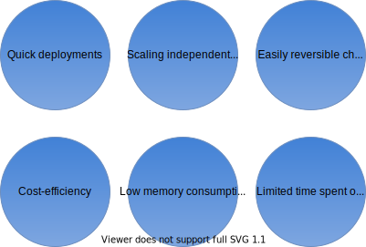

Kyma is an application runtime that provides you a flexible and easy way to connect, extend, and customize your applications in the cloud-native world of Kubernetes.


Out of the box, Kyma offers various functionalities, such as:  

- Serverless development platform to run lightweight Functions in a cost-efficient and scalable way
- System connectivity that provides endpoint to register Events and APIs of external applications
- Eventing that provides messaging channel to receive events, enrich them, and trigger business flows using Functions or services
- Service Mesh for service-to-service communication and proxying
- Service management
- Secure API exposure
- In-cluster observability
- CLI supported by the intuitive Kyma Dashboard

Read about [Kyma main areas](#overview-main-areas) to learn more.

Kyma is built upon leading cloud-native, open-source projects, such as Istio, NATS, Serverless, and Prometheus. The features developed by Kyma are the unique “glue” that holds them together, so you can connect and extend your applications easily and intuitively. To learn how to do that, head over to the [Get Started](../get-started) section where you can find step-by-step instructions to get your environment up and running.

The extensions and customizations you create are decoupled from your core applications, which adds to these general advantages of using Kyma:




:::: tabs

::: tab title
The extensions and customizations you create are decoupled from your core applications, which adds to these general advantages of using Kyma
:::


::: tab javascript
``` javascript
() => {
  console.log('Javascript code example')
}
```
:::

::::
